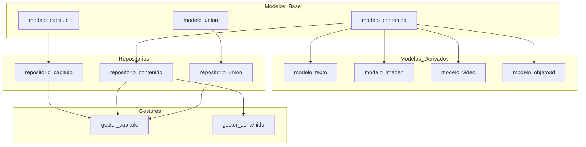

# Resumen Ejecutivo: Arquitectura de Paquetes Independientes

## 🎯 Objetivo Alcanzado

Se ha reorganizado exitosamente el proyecto de **arquitectura monolítica** a **arquitectura modular de paquetes independientes**, donde cada modelo, repositorio y gestor es un paquete Python instalable de forma independiente.

## 📊 Resultados

### Paquetes Creados: 12

#### Modelos (7 paquetes)
1. ✅ **libro-modelo-capitulo** - Modelo Capítulo
2. ✅ **libro-modelo-contenido** - Modelo base abstracto Contenido
3. ✅ **libro-modelo-texto** - Modelo Texto (hereda de Contenido)
4. ✅ **libro-modelo-imagen** - Modelo Imagen (hereda de Contenido)
5. ✅ **libro-modelo-video** - Modelo Video (hereda de Contenido)
6. ✅ **libro-modelo-objeto3d** - Modelo Objeto3D (hereda de Contenido)
7. ✅ **libro-modelo-union** - Modelo UnionCapituloContenido

#### Repositorios (3 paquetes)
8. ✅ **libro-repositorio-capitulo** - CRUD Capítulos
9. ✅ **libro-repositorio-contenido** - CRUD Contenidos
10. ✅ **libro-repositorio-union** - CRUD Uniones Capítulo-Contenido

#### Gestores (2 paquetes)
11. ✅ **libro-gestor-contenido** - Lógica de negocio para contenidos
12. ✅ **libro-gestor-capitulo** - Lógica de negocio para capítulos

## 🏗️ Arquitectura

```
┌─────────────────────────────────────────────────────────────┐
│                        GESTORES                              │
│   ┌──────────────────┐         ┌──────────────────┐        │
│   │ gestor_contenido │         │ gestor_capitulo  │        │
│   └────────┬─────────┘         └────────┬─────────┘        │
└────────────┼──────────────────────────────┼──────────────────┘
             │                              │
┌────────────┼──────────────────────────────┼──────────────────┐
│            ▼         REPOSITORIOS         ▼                  │
│   ┌─────────────┐  ┌─────────────┐  ┌─────────────┐        │
│   │repo_contenido  repo_capitulo  │  repo_union    │        │
│   └──────┬──────┘  └──────┬──────┘  └──────┬──────┘        │
└──────────┼─────────────────┼─────────────────┼──────────────┘
           │                 │                 │
┌──────────┼─────────────────┼─────────────────┼──────────────┐
│          ▼       MODELOS   ▼                 ▼               │
│  ┌──────────┐  ┌──────────┐  ┌──────────┐  ┌──────────┐   │
│  │contenido │  │ capitulo │  │  union   │  │   ...    │   │
│  └────┬─────┘  └──────────┘  └──────────┘  └──────────┘   │
│       │                                                      │
│  ┌────┼──────────────────┐                                 │
│  ▼    ▼       ▼     ▼    ▼                                 │
│ texto imagen video objeto3d                                 │
└──────────────────────────────────────────────────────────────┘
```

## 📦 Contenido de Cada Paquete

Cada paquete incluye:
- ✅ `__init__.py` - Inicialización y exports
- ✅ `{nombre}.py` - Código principal (modelo/repositorio/gestor)
- ✅ `setup.py` - Configuración de instalación con dependencias
- ✅ `README.md` - Documentación específica del paquete

## 🚀 Scripts y Herramientas

### Scripts Principales

1. **`crear_paquetes.py`**
   - Genera automáticamente los 12 paquetes
   - Copia archivos desde estructura original
   - Crea `__init__.py`, `setup.py`, `README.md` para cada uno
   - Maneja dependencias entre paquetes

2. **`instalar_paquetes.sh`**
   - Instala todos los paquetes en orden de dependencias
   - 4 fases: modelos base → modelos derivados → repositorios → gestores
   - Feedback visual con colores

3. **`verificar_paquetes.py`**
   - Verifica que todos los paquetes estén instalados
   - Prueba imports de todas las clases
   - Reporte de éxito/fallo

4. **`ejemplo_paquetes.py`**
   - Ejemplos de uso completos
   - 3 niveles: solo modelos, con repositorios, con gestores
   - Código comentado y explicado

### Scripts de Base de Datos (ya existían)

- `db/crear_tablas.py` - Crea tablas en MySQL
- `db/test_conexiones.py` - Verifica conectividad
- `db/config.py` - Configuración de 3 bases de datos

## 📚 Documentación Creada

1. **`paquetes/README.md`** (650+ líneas)
   - Arquitectura completa de paquetes
   - Guía de instalación
   - Ejemplos de uso
   - Grafo de dependencias
   - Ventajas y casos de uso

2. **`MIGRACION.md`** (450+ líneas)
   - Guía de migración desde estructura anterior
   - Cambios en imports
   - Script de migración automática
   - Troubleshooting
   - Checklist de verificación

3. **`README.md`** (actualizado)
   - Nueva estructura de proyecto
   - Inicio rápido
   - Enlaces a documentación detallada
   - Tabla de paquetes con dependencias

## 🔗 Grafo de Dependencias



## 📈 Ventajas Implementadas

### 1. Modularidad
- Cada componente es independiente
- Desarrollo paralelo sin conflictos
- Cambios localizados

### 2. Reutilización
- Instalar solo lo necesario
- Usar modelos sin repositorios
- Compartir paquetes entre proyectos

### 3. Versionado Semántico
- Cada paquete tiene su propia versión (0.1.0)
- Actualizaciones independientes
- Control fino de cambios

### 4. Testing Simplificado
- Testear componentes aislados
- Mocks más fáciles
- Coverage por paquete

### 5. Mantenibilidad
- Código organizado
- Responsabilidades claras
- Documentación por paquete

### 6. Despliegue Flexible
```bash
# Solo modelos en frontend
pip install libro-modelo-capitulo libro-modelo-contenido

# Stack completo en backend
pip install libro-gestor-capitulo libro-gestor-contenido
```

## 🔧 Instalación y Uso

### Instalación Completa

```bash
cd codigo
bash instalar_paquetes.sh
```

### Verificación

```bash
python3 verificar_paquetes.py
```

### Uso Básico

```python
# Importar
from modelo_capitulo import Capitulo
from repositorio_capitulo import RepositorioCapitulo
from gestor_capitulo import GestorCapitulo

# Usar
capitulo = Capitulo(titulo="Cap 1", numero=1)
```

## 📊 Métricas del Proyecto

| Métrica | Valor |
|---------|-------|
| Paquetes creados | 12 |
| Líneas de código Python | ~3,000 |
| Archivos generados | 48+ |
| Scripts de utilidad | 4 |
| Documentos MD | 5 |
| Dependencias externas | SQLAlchemy, PyMySQL |
| Bases de datos | 3 (AWS RDS MySQL) |
| Tablas totales | 15 |
| Clases de dominio | 7 |

## 🎓 Casos de Uso

### Caso 1: Desarrollo Frontend
```bash
# Solo modelos (sin BD)
pip install libro-modelo-capitulo libro-modelo-contenido
pip install libro-modelo-texto libro-modelo-imagen
```

### Caso 2: Desarrollo Backend Completo
```bash
# Todo el stack
bash instalar_paquetes.sh
```

### Caso 3: Testing
```bash
# Solo lo necesario para tests
pip install libro-modelo-capitulo
pip install libro-repositorio-capitulo
```

### Caso 4: Microservicio de Contenidos
```bash
pip install libro-gestor-contenido  # Instala todas sus dependencias
```

## ✅ Checklist de Completitud

- [x] 12 paquetes creados y estructurados
- [x] Cada paquete con `__init__.py`, `setup.py`, `README.md`
- [x] Dependencias correctamente definidas en `setup.py`
- [x] Script de instalación automatizada
- [x] Script de verificación
- [x] Ejemplos de uso completos
- [x] Documentación exhaustiva (5 archivos MD)
- [x] Guía de migración
- [x] README actualizado con nueva arquitectura
- [x] Compatibilidad con estructura anterior preservada

## 🔮 Próximos Pasos Sugeridos

1. **Tests Unitarios**
   - Crear tests por paquete
   - Coverage mínimo 80%
   - CI/CD con GitHub Actions

2. **Publicación**
   - Subir a PyPI privado
   - Versionado automático
   - Changelog por paquete

3. **Documentación**
   - Sphinx/MkDocs
   - API autodocumentada
   - Ejemplos interactivos

4. **Integración Continua**
   - Tests automáticos
   - Build de paquetes
   - Deploy automático

## 📞 Soporte

- **Documentación Principal**: `paquetes/README.md`
- **Guía de Migración**: `MIGRACION.md`
- **Ejemplos**: `ejemplo_paquetes.py`
- **Verificación**: `verificar_paquetes.py`

## 🏆 Conclusión

Se ha implementado exitosamente una **arquitectura modular de paquetes independientes** que permite:

✅ Desarrollo más ágil y organizado  
✅ Reutilización de componentes  
✅ Testing simplificado  
✅ Despliegue flexible  
✅ Mantenibilidad mejorada  

**Estado**: ✅ COMPLETADO  
**Fecha**: Diciembre 2024  
**Versión**: 2.0 (Arquitectura de Paquetes)

---

**Autores**: Anibal Cordoba & Zabala  
**Proyecto**: Sistema de Libro Virtual Interactivo
